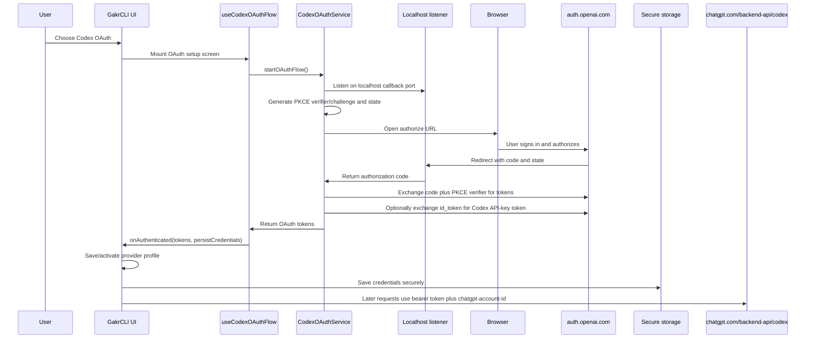

# Codex OAuth Browser Sign-In Flow

This document is the working guide for the Codex OAuth browser sign-in flow in
GakrCLI. It explains what the flow is for, where it is implemented, how the
browser authorization round trip works, where credentials and profiles are
stored, how the saved login is loaded on later runs, and how to debug common
failures.

## What This Flow Does

Codex OAuth lets a user connect GakrCLI to the official ChatGPT/Codex backend by
signing in through a browser. The user does not have to paste a `CODEX_API_KEY`
or copy a Codex CLI `auth.json` file.

After a successful sign-in, GakrCLI can:

- route Codex requests to `https://chatgpt.com/backend-api/codex`
- use Codex model aliases such as `codexplan` and `codexspark`
- store OAuth tokens in native secure storage
- refresh expiring access tokens when a refresh token is available
- create and activate a non-secret provider profile
- send Codex API requests with both a bearer token and `chatgpt-account-id`

The flow is exposed from two UI paths:

- first-run/provider manager: `src/components/ProviderManager.tsx`
- `/provider` wizard: `src/commands/provider/provider.tsx`

Both paths use the shared hook in `src/components/useCodexOAuthFlow.ts`.

## Important Concepts

The implementation stores two different kinds of data.

Sensitive OAuth credentials are stored in native secure storage under the
`codex` key. This includes the access token, refresh token, optional id token,
optional exchanged Codex API-key token, account id, profile id, and refresh
timestamps. The storage implementation is in `src/utils/codexCredentials.ts`
and `src/utils/secureStorage/*`.

Provider profile metadata is stored separately. A Codex OAuth profile records
which backend and model to use, plus the ChatGPT account id, but it does not
store refresh tokens. The profile helpers are in `src/utils/providerProfile.ts`
and the newer profile list is in `src/utils/providerProfiles.ts`.

These two pieces are intentionally separate: the profile says "use Codex", while
secure storage provides the secret token material at request time.

## End-to-End Sequence



## Files Involved

Core OAuth flow:

| File | Responsibility |
| --- | --- |
| `src/services/api/codexOAuth.ts` | Main service. Builds the authorize URL, starts the callback listener, exchanges the authorization code, renders browser success/error/cancel pages, and cleans up. |
| `src/services/api/codexOAuthShared.ts` | Shared constants and helpers: issuer, client id, callback port, scopes, JWT parsing, account-id parsing, and id-token-to-Codex-token exchange. |
| `src/services/oauth/auth-code-listener.ts` | Reusable temporary localhost callback server with callback path and `state` validation. |
| `src/services/oauth/crypto.ts` | PKCE verifier/challenge and OAuth state generation. |

UI integration:

| File | Responsibility |
| --- | --- |
| `src/components/useCodexOAuthFlow.ts` | React hook that starts one OAuth flow for the mounted screen, opens the browser, tracks UI state, and exposes a credential persistence callback. |
| `src/components/ProviderManager.tsx` | First-run/provider manager Codex OAuth setup, profile creation/update, activation, and logout. |
| `src/commands/provider/provider.tsx` | `/provider` wizard Codex OAuth step and legacy single-profile save path. |
| `src/utils/browser.ts` | Opens the authorization URL with the operating system browser command. |

Credential and profile persistence:

| File | Responsibility |
| --- | --- |
| `src/utils/codexCredentials.ts` | Read/write/clear secure Codex credentials and refresh access tokens. |
| `src/utils/secureStorage/index.ts` | Selects native secure storage and controls plaintext fallback behavior. |
| `src/utils/secureStorage/windowsCredentialStorage.ts` | Windows DPAPI-backed encrypted storage file. |
| `src/utils/secureStorage/macOsKeychainStorage.ts` | macOS Keychain-backed storage. |
| `src/utils/secureStorage/linuxSecretStorage.ts` | Linux Secret Service/libsecret-backed storage. |
| `src/utils/providerProfile.ts` | Builds Codex OAuth profile env, legacy single-profile file helpers, and in-session profile application. |
| `src/utils/providerProfiles.ts` | Newer saved provider-profile list and active profile selection. |
| `src/services/api/providerConfig.ts` | Resolves Codex aliases, transport, `auth.json`, secure-storage credentials, and runtime credential precedence. |

Runtime API usage:

| File | Responsibility |
| --- | --- |
| `src/services/api/openaiShim.ts` | Selects Codex transport, refreshes stored credentials, resolves runtime credentials, validates auth/account id, and calls the Codex shim. |
| `src/services/api/codexShim.ts` | Sends Codex Responses API requests to the official backend with auth headers. |
| `src/services/api/codexUsage.ts` | Fetches Codex usage with refreshed/resolved credentials. |
| `src/tools/WebSearchTool/WebSearchTool.ts` | Uses Codex credentials/account id for Codex web search mode. |

Tests:

| File | Coverage |
| --- | --- |
| `src/components/useCodexOAuthFlow.test.tsx` | Hook persistence behavior and a regression test that prevents browser relaunch loops after status updates. |
| `src/services/api/codexOAuth.test.ts` | Service success page and cancellation during token exchange. |
| `src/services/oauth/auth-code-listener.test.ts` | Listener cancellation behavior. |
| `src/utils/codexCredentials.test.ts` | Secure storage normalization, refresh, cooldown, and profile linkage. |
| `src/services/api/providerConfig.codexSecureStorage.test.ts` | Secure-storage credential resolution. |
| `src/services/api/providerConfig.runtimeCodexCredentials.test.ts` | Runtime credential precedence. |
| `src/services/api/codexUsage.test.ts` | Usage endpoint credential handling. |
| `src/services/api/codexShim.test.ts` | Codex transport and request behavior. |

## OAuth Constants

The constants live in `src/services/api/codexOAuthShared.ts`.

| Constant or env var | Value or behavior |
| --- | --- |
| Issuer | `https://auth.openai.com` |
| Authorize endpoint | `https://auth.openai.com/oauth/authorize` |
| Token endpoint | `https://auth.openai.com/oauth/token` |
| Default client id | `app_EMoamEEZ73f0CkXaXp7hrann` |
| Default callback port | `1455` |
| Callback path | `/auth/callback` |
| Redirect URI | `http://localhost:1455/auth/callback` by default |
| Scope | `openid profile email offline_access api.connectors.read api.connectors.invoke` |
| Originator | `codex_cli_rs` |
| `CODEX_OAUTH_CLIENT_ID` | Overrides the default client id. |
| `CODEX_OAUTH_CALLBACK_PORT` | Overrides the callback port. Invalid values fall back to `1455`. |

The authorize URL includes:

| Parameter | Purpose |
| --- | --- |
| `response_type=code` | Requests an authorization code. |
| `client_id` | Codex OAuth client id. |
| `redirect_uri` | Localhost callback URL. |
| `scope` | OpenID, offline access, profile/email, and Codex connector scopes. |
| `code_challenge` | PKCE S256 challenge. |
| `code_challenge_method=S256` | PKCE method. |
| `id_token_add_organizations=true` | Requests account/organization information in token data. |
| `codex_cli_simplified_flow=true` | Matches the Codex CLI-style browser flow. |
| `state` | CSRF protection token validated by the listener. |
| `originator=codex_cli_rs` | Identifies the flow as Codex CLI-compatible. |

## Step-By-Step Runtime Flow

### 1. The User Selects Codex OAuth

The provider manager renders `CodexOAuthSetup` in
`src/components/ProviderManager.tsx`. The `/provider` command renders
`CodexOAuthStep` in `src/commands/provider/provider.tsx`.

Both components call `useCodexOAuthFlow()` and provide an `onAuthenticated`
callback. That callback receives:

- the OAuth tokens returned by `CodexOAuthService`
- `persistCredentials(options?)`, a function that writes those tokens to secure
  storage after the profile has been saved

The UI saves the profile first and then persists credentials with the saved
profile id when one is available. This avoids storing credentials that point at
a profile that failed to save.

### 2. The Hook Starts One Flow For The Mounted Screen

`src/components/useCodexOAuthFlow.ts` starts the flow in a React effect.

It first rejects `--bare` mode because bare mode disables secure storage.

Then it creates `CodexOAuthService`, calls `startOAuthFlow()`, opens the
browser when the service provides an authorize URL, and updates UI state:

- `starting`
- `waiting` with the authorize URL and browser-open result
- `error` with a displayable message

The hook keeps the latest `onAuthenticated` callback in a ref. This matters
because provider screens can re-render while the OAuth flow is waiting. A
re-render must not cancel the in-progress callback listener and launch a second
browser sign-in. The regression test in `src/components/useCodexOAuthFlow.test.tsx`
verifies that an inline callback changing identity after a status update does
not restart OAuth.

### 3. The Local Callback Listener Starts

`CodexOAuthService.startOAuthFlow()` creates an `AuthCodeListener` for
`/auth/callback` and starts it on the configured callback port.

By default the listener binds to:

```text
http://localhost:1455/auth/callback
```

If that port is in use, the service throws a user-facing error telling the user
that Codex OAuth needs `localhost:<port>`.

The listener is temporary. It exists only while the sign-in flow is active.

### 4. PKCE And State Are Generated

The flow uses OAuth Authorization Code with PKCE:

- `generateCodeVerifier()` creates a random verifier.
- `generateCodeChallenge()` SHA-256 hashes and base64url-encodes the verifier.
- `generateState()` creates a random CSRF state token.

The listener validates the returned `state` before accepting an authorization
code. If the state does not match, the callback returns `400` and the flow is
rejected.

### 5. The Browser Opens

`useCodexOAuthFlow()` calls `openBrowser(authUrl)` from `src/utils/browser.ts`.

Browser behavior by platform:

| Platform | Default command |
| --- | --- |
| Windows | `rundll32` URL open handler |
| macOS | `open` |
| Linux | `xdg-open` |

If `BROWSER` is set, the helper tries that command instead. If the browser
cannot be opened, the UI still shows the authorization URL so the user can copy
it manually.

### 6. OpenAI Redirects Back To Localhost

After the user signs in and authorizes in the browser, OpenAI redirects to:

```text
http://localhost:<port>/auth/callback?code=<authorization-code>&state=<state>
```

`AuthCodeListener` accepts only the configured callback path. It rejects missing
authorization codes and invalid state values.

On a valid callback, it keeps the browser response open while the CLI exchanges
the code for tokens. This lets the CLI return a final success, error, or cancel
HTML page to the same browser tab.

### 7. The Authorization Code Is Exchanged For Tokens

`exchangeAuthorizationCode()` in `src/services/api/codexOAuth.ts` posts to:

```text
https://auth.openai.com/oauth/token
```

The request body is `application/x-www-form-urlencoded`:

| Field | Value |
| --- | --- |
| `grant_type` | `authorization_code` |
| `code` | Authorization code from the callback. |
| `redirect_uri` | The same localhost redirect URI used in the authorize URL. |
| `client_id` | Codex OAuth client id. |
| `code_verifier` | Original PKCE verifier. |

The response must include:

- `access_token`
- `refresh_token`

The response may include:

- `id_token`

If the token endpoint fails, the error includes the HTTP status and response
body when available. If the access token or refresh token is missing, the flow
fails with a clear "missing credentials" error.

### 8. The Optional Codex API-Key Token Is Requested

If an `id_token` is present, GakrCLI attempts an RFC 8693 token exchange using
`exchangeCodexIdTokenForApiKey()` in `src/services/api/codexOAuthShared.ts`.

The request goes to the same token endpoint and sends:

| Field | Value |
| --- | --- |
| `grant_type` | `urn:ietf:params:oauth:grant-type:token-exchange` |
| `client_id` | Codex OAuth client id. |
| `requested_token` | `openai-api-key` |
| `subject_token` | OAuth id token. |
| `subject_token_type` | `urn:ietf:params:oauth:token-type:id_token` |

This exchange is optional. If it fails, OAuth sign-in can still continue using
the access token and refresh token.

### 9. The ChatGPT Account Id Is Extracted

Codex backend requests require the ChatGPT account id. GakrCLI extracts it from
token claims with `parseChatgptAccountId()` in `src/services/api/codexOAuthShared.ts`.

Supported claim shapes:

- nested `https://api.openai.com/auth.chatgpt_account_id`
- flat `https://api.openai.com/auth.chatgpt_account_id`
- top-level `chatgpt_account_id`

The service checks the id token first, then the access token.

If no account id can be found, profile creation fails because a Codex OAuth
provider profile cannot be built safely without `CHATGPT_ACCOUNT_ID`.

### 10. The Browser Gets A Final Page

After token exchange, the pending browser response receives one of three HTML
pages from `src/services/api/codexOAuth.ts`:

- success: "Codex login complete"
- error: "Codex login failed" plus the error message
- cancelled: "Codex login cancelled"

The success page intentionally tells the user to return to GakrCLI. It does not
try to redirect into another web app.

### 11. The Profile Is Saved And Activated

`buildCodexOAuthProfileEnv()` in `src/utils/providerProfile.ts` builds this
non-secret env payload:

```text
OPENAI_BASE_URL=https://chatgpt.com/backend-api/codex
OPENAI_MODEL=codexplan
CHATGPT_ACCOUNT_ID=<account id>
CODEX_CREDENTIAL_SOURCE=oauth
```

In the provider manager, the profile is saved to the global provider-profile
list using `addProviderProfile()` or `updateProviderProfile()` from
`src/utils/providerProfiles.ts`. The active profile id is stored in global
config as `activeProviderProfileId`.

The global profile entry is a sanitized `ProviderProfile` from
`src/utils/config.ts`. For Codex OAuth it is stored roughly like this in the
global config JSON:

```json
{
  "providerProfiles": [
    {
      "id": "provider_abc123def456",
      "name": "Codex OAuth",
      "provider": "openai",
      "baseUrl": "https://chatgpt.com/backend-api/codex",
      "model": "codexplan"
    }
  ],
  "activeProviderProfileId": "provider_abc123def456"
}
```

There is normally no `apiKey` field for Codex OAuth in this profile entry. The
empty API-key value used by the setup UI is sanitized away before saving. The
ChatGPT account id and `CODEX_CREDENTIAL_SOURCE=oauth` are not stored in this
newer global profile object directly; they are represented in the legacy
startup profile file described below and in the secure credential blob.

The `/provider` command also supports a legacy single-profile file through
`saveProfileFile()` in `src/utils/providerProfile.ts`. The newer provider
manager uses the global provider-profile list as the main source of truth.
When an active provider profile is selected through `setActiveProviderProfile()`,
GakrCLI also writes a legacy startup profile so early startup can rebuild env
before the TUI is fully loaded.

That legacy startup file is named `.gakrcli-profile.json` and lives in
`getGakrcliConfigHomeDir()` by default, usually:

```text
~/.gakrcli/.gakrcli-profile.json
```

For Codex OAuth its JSON shape is:

```json
{
  "profile": "codex",
  "env": {
    "OPENAI_BASE_URL": "https://chatgpt.com/backend-api/codex",
    "OPENAI_MODEL": "codexplan",
    "CHATGPT_ACCOUNT_ID": "acct_...",
    "CODEX_CREDENTIAL_SOURCE": "oauth"
  },
  "createdAt": "2026-05-13T00:00:00.000Z"
}
```

This file still does not contain the OAuth access token or refresh token.

After saving the profile, the UI calls `persistCredentials({ profileId })`.

### 12. Credentials Are Saved Securely

`persistCredentials()` calls `saveCodexCredentials()` in
`src/utils/codexCredentials.ts`.

The stored blob shape is:

```ts
type CodexCredentialBlob = {
  apiKey?: string
  accessToken: string
  refreshToken?: string
  idToken?: string
  accountId?: string
  profileId?: string
  lastRefreshAt?: number
  lastRefreshFailureAt?: number
}
```

The secure storage value is the wider `SecureStorageData` JSON object from
`src/utils/secureStorage/index.ts`. The Codex login is stored under the top-level
`codex` property, so the plaintext form before native encryption looks like:

```json
{
  "codex": {
    "apiKey": "optional-exchanged-codex-token",
    "accessToken": "oauth-access-token",
    "refreshToken": "oauth-refresh-token",
    "idToken": "optional-oidc-id-token",
    "accountId": "acct_...",
    "profileId": "provider_abc123def456",
    "lastRefreshAt": 1778611200000
  }
}
```

Other secure-storage features can share the same JSON object under other
top-level keys such as `mcpOAuth`, `trustedDeviceToken`, or `pluginSecrets`.
`clearCodexCredentials()` deletes only the `codex` property and writes the rest
back unchanged.

Codex credentials call `getSecureStorage({ allowPlainTextFallback: false })`.
That means Codex OAuth does not write tokens to the plaintext fallback file
`~/.gakrcli/.credentials.json`. If native secure storage cannot save the
credentials, sign-in fails after profile setup with a secure-storage error.

Native storage by platform:

| OS | Storage implementation and on-disk/keychain format |
| --- | --- |
| Windows | `windowsCredentialStorage` serializes the `SecureStorageData` JSON, encrypts it with DPAPI `ProtectedData.Protect(..., CurrentUser)`, base64-encodes the encrypted bytes, and writes that base64 string to `<config-dir>/<service>.secure.dpapi`. The file is not readable JSON. Legacy PasswordVault reads/deletes are only attempted when `GAKR_ENABLE_LEGACY_WINDOWS_PASSWORDVAULT=1`. |
| macOS | `macOsKeychainStorage` serializes the `SecureStorageData` JSON and stores it as a generic password using the `security` CLI. The service name is the secure-storage service name, and the account is the current username. Writes pass the JSON as hex password data with `security add-generic-password -X`; reads use `security find-generic-password -w`. |
| Linux | `linuxSecretStorage` serializes the `SecureStorageData` JSON and stores it through `secret-tool store --label <service> service <service> account <username>`, passing the JSON payload on stdin. Reads use `secret-tool lookup service <service> account <username>`. |

The secure-storage service name is generated by
`getSecureStorageServiceName('-credentials')` in
`src/utils/secureStorage/macOsKeychainHelpers.ts`. In normal production config
it is:

```text
GakrCLI-credentials
```

If Gakr is running with a non-production OAuth suffix or a non-default
`GAKR_CONFIG_DIR`, the service name gets a suffix such as
`-staging-oauth`, `-local-oauth`, `-custom-oauth`, and/or an eight-character
hash of the config directory. On Windows the same service name is sanitized and
used as the DPAPI file name stem.

The generic plaintext fallback storage, when allowed by other features, writes
the same `SecureStorageData` JSON to:

```text
<config-dir>/.credentials.json
```

with file mode `0600`. Codex OAuth explicitly disables this fallback.

The config directory is resolved by `getGakrcliConfigHomeDir()` in
`src/utils/envUtils.ts`. It defaults to `~/.gakrcli`, unless `GAKR_CONFIG_DIR`
is set. If a legacy `~/.claude` directory exists and `~/.gakrcli` does not, the
resolver may use the legacy directory for compatibility.

The global provider-profile config path is resolved by `getGlobalGakrcliFile()`
in `src/utils/env.ts`. By default it is `~/.gakrcli.json`, with suffix and
legacy fallback behavior for OAuth/config variants.
`saveGlobalConfig()` writes JSON with mode `0600` and filters out default values,
so empty defaults like an empty provider profile list may be omitted from disk.

## Loading A Saved Codex OAuth Login

Startup has two connected paths: profile loading and credential loading.

Profile loading:

1. `applyActiveProviderProfileFromConfig()` in `src/utils/providerProfiles.ts`
   reads the global config.
2. `getActiveProviderProfile()` selects `activeProviderProfileId`, or falls
   back to the first profile.
3. `applyProviderProfileToProcessEnv()` applies the selected profile to
   `process.env`.
4. For the saved Codex OAuth global profile, this applies OpenAI-compatible
   routing env such as `GAKR_CODE_USE_OPENAI=1`, `OPENAI_BASE_URL`, and
   `OPENAI_MODEL`. The global profile object itself does not carry
   `CHATGPT_ACCOUNT_ID`; request-time credential resolution gets the account id
   from secure storage, token claims, env overrides, or `auth.json`.
5. `setActiveProviderProfile()` also keeps the legacy `.gakrcli-profile.json`
   file in sync when the active profile changes, so future startup can rebuild
   the Codex OAuth env marker and account id early.

Legacy single-profile loading:

1. `buildStartupEnvFromProfile()` in `src/utils/providerProfile.ts` reads the
   legacy profile file with `loadProfileFile()`.
2. `loadProfileFile()` first checks the default config-dir path
   `<config-dir>/.gakrcli-profile.json`. If no file exists there, it checks the
   legacy working-directory path `./.gakrcli-profile.json`.
3. If the newer provider-profile system has already applied env, the legacy file
   is skipped to avoid overwriting the active saved profile.
4. If there is no saved profile, Codex defaults may be injected so the provider
   picker starts from the Codex-first default.

Credential loading:

1. Before Codex requests, `openaiShim.ts` calls
   `refreshCodexAccessTokenIfNeeded()`.
2. It then calls `resolveRuntimeCodexCredentials()`.
3. Runtime resolution uses explicit env or explicit auth file first, then
   freshly read secure-storage credentials, then default Codex CLI `auth.json`
   when appropriate.
4. The Codex shim sends `Authorization: Bearer <token>` and
   `chatgpt-account-id: <account id>`.

## Runtime Credential Priority

For Codex API calls, `src/services/api/providerConfig.ts` resolves credentials
in this order:

1. `CODEX_API_KEY`
2. Explicit Codex auth file via `CODEX_AUTH_JSON_PATH` or `CODEX_HOME`
3. Secure-storage Codex OAuth credentials
4. Default Codex CLI auth file at `~/.codex/auth.json`

There is one important detail: if an explicit auth file path is configured, that
explicit configuration is respected even when the file is missing or incomplete.
In that case GakrCLI does not silently fall back to secure-storage OAuth.

Supported `auth.json` bearer token fields include:

- `openai_api_key`
- `openaiApiKey`
- `access_token`
- `accessToken`
- `tokens.access_token`
- `tokens.accessToken`
- `auth.access_token`
- `auth.accessToken`
- `token.access_token`
- `token.accessToken`

The account id can come from:

- `CODEX_ACCOUNT_ID`
- `CHATGPT_ACCOUNT_ID`
- `account_id` or `accountId` fields in `auth.json`
- JWT claims in the bearer token
- JWT claims in an id token
- stored OAuth credential metadata

OIDC `id_token` values are used only to discover account metadata or exchange
for a Codex API-key token. They are not treated as bearer credentials for Codex
API requests.

## Token Refresh

`refreshCodexAccessTokenIfNeeded()` in `src/utils/codexCredentials.ts` refreshes
stored OAuth credentials.

Refresh behavior:

- skipped in `--bare` mode
- skipped when `CODEX_API_KEY` is explicitly set
- skipped when no secure-storage Codex credentials exist
- skipped when no refresh token is stored
- triggered when the access token or id token expires within the refresh skew
- deduplicated with a shared in-flight refresh promise
- cooled down briefly after refresh failure
- saved back to native secure storage after a successful refresh

The refresh request posts to:

```text
https://auth.openai.com/oauth/token
```

with:

```text
grant_type=refresh_token
client_id=<Codex OAuth client id>
refresh_token=<stored refresh token>
```

If the refreshed response includes an id token, GakrCLI again attempts the
optional id-token-to-Codex-token exchange.

## How Requests Use The Login

Codex request routing is determined in `src/services/api/providerConfig.ts`.

The official Codex base URL is:

```text
https://chatgpt.com/backend-api/codex
```

`codexplan` and `codexspark` are shortcut aliases that resolve to Codex
transport. When the official Codex backend or a Codex alias is selected,
`resolveProviderRequest()` uses the `codex_responses` transport.

`openaiShim.ts` then:

1. refreshes stored OAuth credentials if needed
2. resolves runtime Codex credentials
3. requires a bearer credential
4. requires a ChatGPT account id
5. calls `performCodexRequest()` in `src/services/api/codexShim.ts`

`performCodexRequest()` sends the request to:

```text
https://chatgpt.com/backend-api/codex/responses
```

with headers:

```text
Authorization: Bearer <apiKey or accessToken>
chatgpt-account-id: <account id>
originator: gakrcli
```

## Logout And Cleanup

The provider manager exposes "Log out Codex OAuth" when stored OAuth credentials
exist.

Logout does the following:

1. clears the `codex` key from secure storage with `clearCodexCredentials()`
2. removes the associated Codex OAuth provider profile when found
3. clears persisted legacy Codex OAuth profile data
4. clears startup provider overrides when needed
5. refreshes provider/profile UI state

`clearCodexCredentials()` removes only the Codex credential entry. It leaves
other secure-storage entries, such as MCP OAuth credentials, intact.

## Environment Variables

| Variable | Purpose |
| --- | --- |
| `CODEX_OAUTH_CLIENT_ID` | Override the Codex OAuth client id. |
| `CODEX_OAUTH_CALLBACK_PORT` | Override the localhost callback port. |
| `CODEX_API_KEY` | Explicit Codex bearer token. Takes priority over OAuth storage. |
| `CODEX_AUTH_JSON_PATH` | Explicit Codex CLI-compatible `auth.json` path. |
| `CODEX_HOME` | Alternative Codex home directory; auth file resolves to `<CODEX_HOME>/auth.json`. |
| `CODEX_ACCOUNT_ID` | Explicit ChatGPT account id. |
| `CHATGPT_ACCOUNT_ID` | Explicit ChatGPT account id fallback. |
| `OPENAI_BASE_URL` | For Codex OAuth profiles, set to the official Codex backend. |
| `OPENAI_MODEL` | Codex aliases such as `codexplan` or `codexspark`. |
| `CODEX_CREDENTIAL_SOURCE` | Profile marker. `oauth` means secrets are stored separately in secure storage. |
| `GAKR_CONFIG_DIR` | Overrides the Gakr config directory. |
| `GAKR_ENABLE_LEGACY_WINDOWS_PASSWORDVAULT` | Enables best-effort legacy Windows PasswordVault compatibility. |

## Error Handling

Common failures and where they are handled:

| Failure | Behavior |
| --- | --- |
| `--bare` mode | Hook returns an error because secure storage is disabled. |
| Callback port in use | Service tells the user to free `localhost:<port>`. |
| Browser launch fails | UI shows the authorize URL for manual copy/paste. |
| Missing authorization code | Listener responds `400` and rejects the flow. |
| Invalid state | Listener responds `400` and rejects the flow. |
| Token endpoint failure | Service includes HTTP status and response body when available. |
| Missing access or refresh token | Service rejects with a missing credentials error. |
| Missing account id | Profile creation fails because `CHATGPT_ACCOUNT_ID` cannot be built. |
| Secure-storage save failure | Hook throws a persistence error after profile setup attempts to save credentials. |
| Cancellation/unmount | Service aborts token exchange, completes pending browser response with cancel HTML, rejects pending authorization, and closes the listener. |

## Browser Reopening Loop: Fixed Behavior

The reported symptom was:

1. GakrCLI opens the browser.
2. The user authorizes.
3. The browser or CLI shows an error.
4. Returning to GakrCLI starts the browser flow again.
5. The same cycle repeats.

The root cause was the shared React hook restarting the OAuth effect whenever
the `onAuthenticated` callback identity changed. Provider screens can pass
callbacks that are recreated during render. The hook also updates state when the
browser URL is ready and when browser-open succeeds. Those state updates can
cause a re-render. Before the fix, a changed callback identity was enough to
run the effect cleanup, cancel the active listener/token exchange, and start a
fresh OAuth flow that opened the browser again.

The fix is in `src/components/useCodexOAuthFlow.ts`:

- the latest `onAuthenticated` callback is stored in a React ref
- the OAuth-starting effect no longer depends on `onAuthenticated`
- re-rendering the screen updates the ref but does not restart the flow
- cleanup still runs when the screen actually unmounts or dependencies that
  own the service/browser behavior change

The regression test is in `src/components/useCodexOAuthFlow.test.tsx`:

- it passes an inline `onAuthenticated` callback that changes identity after
  status updates
- it verifies `startOAuthFlow()` is called only once
- it verifies cleanup is not called just because the callback changed

## Practical User Flow

1. Start GakrCLI.
2. Open provider setup or run `/provider`.
3. Choose `Codex OAuth`.
4. GakrCLI starts a temporary localhost listener.
5. GakrCLI opens the browser authorization URL.
6. Sign in with ChatGPT/OpenAI and authorize.
7. Browser redirects to `http://localhost:1455/auth/callback` by default.
8. GakrCLI validates `state`, exchanges the code for tokens, and extracts the
   account id.
9. GakrCLI saves or updates a `Codex OAuth` provider profile.
10. GakrCLI saves OAuth credentials to native secure storage.
11. The current session is activated when possible; otherwise the profile is
   saved for next startup.
12. Later Codex requests use secure-storage credentials and refresh tokens when
   needed.

## Troubleshooting Checklist

If browser OAuth still fails:

1. Check whether `localhost:1455` is already in use. If needed, set
   `CODEX_OAUTH_CALLBACK_PORT` to another free port.
2. Check whether `CODEX_OAUTH_CLIENT_ID` is set. A bad override can cause
   authorize or token exchange failures.
3. Check whether `CODEX_AUTH_JSON_PATH` or `CODEX_HOME` is set. Explicit auth
   file settings take priority over secure-storage OAuth and can block fallback.
4. Check whether `CODEX_API_KEY` is set. It overrides secure-storage OAuth.
5. Confirm native secure storage works on the current platform. Codex OAuth does
   not allow plaintext fallback for tokens.
6. If the flow completed but requests fail, verify a ChatGPT account id is
   available from stored credentials, token claims, `CHATGPT_ACCOUNT_ID`, or
   `CODEX_ACCOUNT_ID`.
7. If the browser opens repeatedly, confirm the build includes the hook fix
   described in "Browser Reopening Loop: Fixed Behavior".

## Security Notes

- The OAuth flow uses PKCE S256.
- A random `state` value protects the callback from CSRF.
- The listener binds to `localhost` and accepts only the configured callback
  path.
- Browser callback responses are completed with local success/error/cancel HTML.
- Codex OAuth credentials require native secure storage.
- Provider profiles store routing metadata, not refresh tokens.
- Explicit env credentials override stored OAuth credentials and should be
  treated as sensitive.
