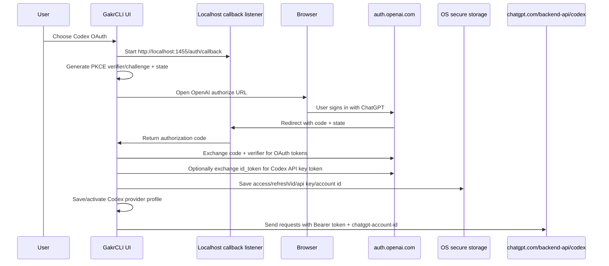

# Codex OAuth Browser Sign-In Flow

This document explains the Codex OAuth browser sign-in implementation in GakrCLI: what it is for, how the flow works end-to-end, how credentials are stored and used, and which files implement or consume it.

## Purpose

Codex OAuth lets a user authenticate GakrCLI with their ChatGPT/Codex account through a browser sign-in instead of manually providing a `CODEX_API_KEY` or copying an existing Codex CLI `auth.json` file.

After sign-in, GakrCLI can:

- call the official ChatGPT Codex backend at `https://chatgpt.com/backend-api/codex`
- use Codex model aliases such as `codexplan` and `codexspark`
- persist Codex credentials in OS secure storage for later sessions
- refresh expiring OAuth tokens when a refresh token is available
- build and activate a provider profile without storing secrets in provider profile files

The flow is exposed in provider setup screens such as `/provider` and the first-run provider manager.

## High-level architecture



## Where credentials and profiles are stored

Codex OAuth stores two different kinds of data in two different places:

1. **Sensitive OAuth credential material**: access token, refresh token, id token, optional Codex API-key token, account id, and profile id.
2. **Non-secret provider profile metadata**: provider name, Codex base URL, model alias, and active-profile selection.

### Sensitive Codex OAuth credentials

Sensitive Codex OAuth credentials are stored under the secure-storage key `codex` (`src/utils/codexCredentials.ts:12`). The credential object shape is defined by `CodexCredentialBlob` (`src/utils/codexCredentials.ts:16`).

GakrCLI intentionally calls `getSecureStorage({ allowPlainTextFallback: false })` for Codex credentials (`src/utils/codexCredentials.ts:41`). That means Codex OAuth credentials do **not** use the plaintext fallback file `~/.gakrcli/.credentials.json`. If native secure storage cannot be used, saving Codex OAuth credentials fails instead of writing the tokens in plaintext.

The generic plaintext fallback implementation does exist at `src/utils/secureStorage/plainTextStorage.ts:13`, and it would write `.credentials.json` inside `getGakrcliConfigHomeDir()` with mode `0600` (`src/utils/secureStorage/plainTextStorage.ts:44`). However, Codex OAuth disables that fallback, so it is not the normal Codex OAuth storage path.

Native secure-storage backend selection is implemented in `src/utils/secureStorage/index.ts:65`:

| OS | Backend | Where/how it is stored |
| --- | --- | --- |
| Windows | DPAPI-backed `windowsCredentialStorage` | Encrypted file named like `<service>.secure.dpapi` inside the Gakr config directory, protected with Windows DPAPI `CurrentUser` scope (`src/utils/secureStorage/windowsCredentialStorage.ts:28` and `src/utils/secureStorage/windowsCredentialStorage.ts:142`). It can also read legacy Windows PasswordVault entries (`src/utils/secureStorage/windowsCredentialStorage.ts:63`). |
| macOS | Keychain-backed `macOsKeychainStorage` | macOS Keychain generic password entry using the `security` CLI (`src/utils/secureStorage/macOsKeychainStorage.ts:26`). The service name is based on `Gakr...-credentials` (`src/utils/secureStorage/macOsKeychainHelpers.ts:27`). |
| Linux | Secret Service/libsecret | `secret-tool` stores a Secret Service entry with service/account attributes (`src/utils/secureStorage/linuxSecretStorage.ts:14`). |

The Gakr config directory defaults to `~/.gakrcli`, unless `GAKR_CONFIG_DIR` is set (`src/utils/envUtils.ts:8`). On this Windows setup, the Codex secure-storage backend resolves to the DPAPI encrypted file `C:\Users\gajja\.gakrcli\Gakr-credentials.secure.dpapi`. This file is the encrypted credential container; it is not readable JSON token data.

The active provider profile is stored separately in the global GakrCLI config file. On this Windows setup, that file is `C:\Users\gajja\.gakrcli.json`: the `providerProfiles` list contains the `Codex OAuth` profile, and `activeProviderProfileId` points to that Codex OAuth profile. The small `C:\Users\gajja\.gakrcli\config.json` file is not the active provider-profile store; it only contains version/creation metadata.

### Provider profile metadata

The provider profile is not the OAuth token store. It only records enough non-secret routing information to select Codex later.

For Codex OAuth, `buildCodexOAuthProfileEnv()` creates this profile env (`src/utils/providerProfile.ts:554`):

```text
OPENAI_BASE_URL=https://chatgpt.com/backend-api/codex
OPENAI_MODEL=codexplan
CHATGPT_ACCOUNT_ID=<account id>
CODEX_CREDENTIAL_SOURCE=oauth
```

The newer provider-profile system stores profiles in global config through `saveGlobalConfig()` via `addProviderProfile()` and `updateProviderProfile()` (`src/utils/providerProfiles.ts:755` and `src/utils/providerProfiles.ts:791`). The active profile id is stored as `activeProviderProfileId` with the `providerProfiles` list (`src/utils/providerProfiles.ts:766`). The global config file path is resolved by `getGlobalGakrcliFile()` (`src/utils/env.ts:14`), typically `~/.gakrcli.json` or a suffix variant in the home/config directory.

There is also a legacy single-profile file path handled by `loadProfileFile()` / `saveProfileFile()` (`src/utils/providerProfile.ts:633` and `src/utils/providerProfile.ts:647`). The current `/provider` profile list uses the newer global config profile list.

## End-to-end flow

### 1. User selects Codex OAuth

There are two main UI entry points:

- `src/commands/provider/provider.tsx:1087` implements the `/provider` wizard `CodexOAuthStep`.
- `src/components/ProviderManager.tsx:332` implements the first-run/provider-manager `CodexOAuthSetup` screen.

Both screens call the shared React hook `useCodexOAuthFlow` from `src/components/useCodexOAuthFlow.ts:44`.

The UI tells the user to finish signing in with ChatGPT in the browser. If browser launch fails, the UI displays the authorization URL for manual copy/paste.

### 2. The hook starts the OAuth service

`src/components/useCodexOAuthFlow.ts:62` starts the flow in a React effect.

Important behavior:

- It refuses to run in `--bare` mode because secure storage is disabled (`src/components/useCodexOAuthFlow.ts:63`).
- It creates `CodexOAuthService` (`src/components/useCodexOAuthFlow.ts:37`).
- It opens the authorization URL with `openBrowser` (`src/components/useCodexOAuthFlow.ts:75`).
- On success, it provides a `persistCredentials()` callback that saves credentials securely (`src/components/useCodexOAuthFlow.ts:94`).
- On component cleanup/cancel, it calls `oauthService.cleanup()` (`src/components/useCodexOAuthFlow.ts:121`).

### 3. Local callback server starts

`CodexOAuthService.startOAuthFlow()` is implemented in `src/services/api/codexOAuth.ts:183`.

It creates an `AuthCodeListener` for `/auth/callback` and starts it on the configured callback port:

- default port: `1455`
- callback path: `/auth/callback`
- redirect URI: `http://localhost:1455/auth/callback`

The constants live in `src/services/api/codexOAuthShared.ts:1`:

- issuer: `https://auth.openai.com`
- default OAuth client id: `app_EMoamEEZ73f0CkXaXp7hrann`
- default callback port: `1455`
- scope: `openid profile email offline_access api.connectors.read api.connectors.invoke`
- originator: `codex_cli_rs`

The port can be overridden with `CODEX_OAUTH_CALLBACK_PORT` (`src/services/api/codexOAuthShared.ts:26`). The client id can be overridden with `CODEX_OAUTH_CLIENT_ID` (`src/services/api/codexOAuthShared.ts:20`).

If the callback port is unavailable, the service throws a user-facing error explaining that Codex OAuth needs `localhost:<port>` (`src/services/api/codexOAuth.ts:274`).

### 4. PKCE and CSRF state are generated

The flow uses OAuth Authorization Code + PKCE:

- `generateCodeVerifier()` creates a random verifier (`src/services/oauth/crypto.ts:11`).
- `generateCodeChallenge()` SHA-256 hashes the verifier and base64url encodes it (`src/services/oauth/crypto.ts:15`).
- `generateState()` creates a random state token for CSRF protection (`src/services/oauth/crypto.ts:21`).

The callback listener validates that the returned state matches the expected state (`src/services/oauth/auth-code-listener.ts:223`).

### 5. Authorization URL is built and opened

`buildCodexAuthorizeUrl()` builds the OpenAI authorization URL (`src/services/api/codexOAuth.ts:33`).

It sends these query parameters:

| Parameter | Purpose |
| --- | --- |
| `response_type=code` | Requests an authorization code. |
| `client_id` | Codex OAuth client id. |
| `redirect_uri` | Localhost callback URL. |
| `scope` | OpenID, profile/email, offline access, and Codex connector scopes. |
| `code_challenge` | PKCE S256 challenge. |
| `code_challenge_method=S256` | PKCE challenge method. |
| `id_token_add_organizations=true` | Asks for organization/account information in token data. |
| `codex_cli_simplified_flow=true` | Matches Codex CLI-style simplified browser flow. |
| `state` | CSRF protection token. |
| `originator=codex_cli_rs` | Identifies the flow as Codex CLI-compatible. |

The URL points to:

```text
https://auth.openai.com/oauth/authorize
```

### 6. Browser redirects to localhost with code and state

`AuthCodeListener` is a temporary localhost HTTP server in `src/services/oauth/auth-code-listener.ts:18`.

It is not an OAuth provider. It only captures the redirect from the browser.

Behavior:

- Listens on `localhost` (`src/services/oauth/auth-code-listener.ts:46`).
- Accepts only the configured callback path (`src/services/oauth/auth-code-listener.ts:199`).
- Reads `code` and `state` query parameters (`src/services/oauth/auth-code-listener.ts:205`).
- Rejects missing authorization code (`src/services/oauth/auth-code-listener.ts:216`).
- Rejects invalid state (`src/services/oauth/auth-code-listener.ts:223`).
- Keeps the browser response open until GakrCLI can return a final success/error/cancel HTML page (`src/services/oauth/auth-code-listener.ts:230`).

After a successful token exchange, `CodexOAuthService` serves a success HTML page that tells the user to return to GakrCLI (`src/services/api/codexOAuth.ts:55` and `src/services/api/codexOAuth.ts:236`).

If the flow fails or is cancelled, the browser receives an error or cancelled HTML page (`src/services/api/codexOAuth.ts:75`, `src/services/api/codexOAuth.ts:96`, and `src/services/api/codexOAuth.ts:255`).

### 7. Authorization code is exchanged for tokens

`exchangeAuthorizationCode()` posts the code to OpenAI's token endpoint (`src/services/api/codexOAuth.ts:115`).

Endpoint:

```text
https://auth.openai.com/oauth/token
```

Request fields:

| Field | Value |
| --- | --- |
| `grant_type` | `authorization_code` |
| `code` | Authorization code from callback. |
| `redirect_uri` | Same localhost redirect URI. |
| `client_id` | Codex OAuth client id. |
| `code_verifier` | Original PKCE verifier. |

The response must include:

- `access_token`
- `refresh_token`

It may include:

- `id_token`

If access or refresh token is missing, the flow fails with a clear error (`src/services/api/codexOAuth.ts:150`).

### 8. Optional id-token-to-API-key exchange

If an `id_token` is returned, GakrCLI attempts a token exchange to obtain a Codex API key token (`src/services/api/codexOAuth.ts:159`).

The helper is `exchangeCodexIdTokenForApiKey()` in `src/services/api/codexOAuthShared.ts:101`.

It posts to the same token endpoint with:

| Field | Value |
| --- | --- |
| `grant_type` | `urn:ietf:params:oauth:grant-type:token-exchange` |
| `requested_token` | `openai-api-key` |
| `subject_token` | OAuth `id_token` |
| `subject_token_type` | `urn:ietf:params:oauth:token-type:id_token` |

If this optional API-key exchange fails, the main OAuth sign-in can still continue with access/refresh tokens because the call is caught and converted to `undefined` (`src/services/api/codexOAuth.ts:160`).

### 9. ChatGPT account id is extracted

Codex backend requests require the ChatGPT account id header.

GakrCLI extracts it from JWT payload claims using `parseChatgptAccountId()` (`src/services/api/codexOAuthShared.ts:61`). It checks:

- nested `https://api.openai.com/auth.chatgpt_account_id`
- flat `https://api.openai.com/auth.chatgpt_account_id`
- top-level `chatgpt_account_id`

The OAuth service tries to parse the account id from the `id_token`, then from the access token (`src/services/api/codexOAuth.ts:169`).

### 10. Credentials are saved to secure storage

The hook creates a `persistCredentials()` callback (`src/components/useCodexOAuthFlow.ts:94`). The caller invokes this callback after it has successfully built/saved the provider profile.

Credentials are saved through `saveCodexCredentials()` in `src/utils/codexCredentials.ts:183`.

Stored fields are defined by `CodexCredentialBlob` (`src/utils/codexCredentials.ts:16`):

- `apiKey`
- `accessToken`
- `refreshToken`
- `idToken`
- `accountId`
- `profileId`
- `lastRefreshAt`
- `lastRefreshFailureAt`

The storage key is `codex` (`src/utils/codexCredentials.ts:12`).

Security behavior:

- Codex credentials use native OS secure storage only.
- Plaintext fallback is disabled for Codex credentials (`src/utils/codexCredentials.ts:41`).
- Codex OAuth credentials are **not normally written as plaintext into `~/.gakrcli/.credentials.json`**. That plaintext file belongs to the generic fallback storage implementation, but Codex OAuth requests native secure storage with fallback disabled.
- On Windows, the native backend writes an encrypted DPAPI blob under the Gakr config directory, protected for the current Windows user (`src/utils/secureStorage/windowsCredentialStorage.ts:28`).
- On macOS, the native backend writes a Keychain generic password entry (`src/utils/secureStorage/macOsKeychainStorage.ts:26`).
- On Linux, the native backend writes a Secret Service entry through `secret-tool` (`src/utils/secureStorage/linuxSecretStorage.ts:14`).
- If secure storage is unavailable, saving fails instead of writing plaintext.
- `--bare` mode disables secure storage reads/writes (`src/utils/codexCredentials.ts:149` and `src/utils/codexCredentials.ts:183`).

The platform storage selector is in `src/utils/secureStorage/index.ts:61`:

- macOS: Keychain
- Linux: libsecret/Secret Service
- Windows: Credential Locker

### 11. Provider profile is saved/activated

Codex OAuth credentials are stored separately from provider profiles. The provider profile stores non-secret routing information.

`buildCodexOAuthProfileEnv()` returns this profile env (`src/utils/providerProfile.ts:554`):

```text
OPENAI_BASE_URL=https://chatgpt.com/backend-api/codex
OPENAI_MODEL=codexplan
CHATGPT_ACCOUNT_ID=<account id>
CODEX_CREDENTIAL_SOURCE=oauth
```

In the provider manager, a `Codex OAuth` provider profile is added or updated (`src/components/ProviderManager.tsx:1738`). The default model is `codexplan` (`src/components/ProviderManager.tsx:167`).

After saving the profile, GakrCLI:

1. persists the credentials with the saved profile id (`src/components/ProviderManager.tsx:1779`)
2. clears startup provider override if needed (`src/components/ProviderManager.tsx:1780`)
3. applies the saved profile to the current session (`src/components/ProviderManager.tsx:742`)
4. reports whether the current session switched immediately or only the next startup was saved (`src/components/ProviderManager.tsx:730`)

The `/provider` wizard also supports Codex OAuth through `CodexOAuthStep` (`src/commands/provider/provider.tsx:1087`).

## Startup/load path: how the saved Codex OAuth profile becomes active

After Codex OAuth setup completes, later sessions load the saved profile and credentials through two connected paths:

1. **Profile selection/loading**
   - `getProviderProfiles()` reads the saved provider list from global config (`src/utils/providerProfiles.ts:390`).
   - `getActiveProviderProfile()` selects `activeProviderProfileId`, or the first profile if no active id is set (`src/utils/providerProfiles.ts:573`).
   - `applyActiveProviderProfileFromConfig()` applies the active profile to `process.env` unless explicit startup provider env already takes priority (`src/utils/providerProfiles.ts:712`).
   - For an OpenAI-compatible Codex profile, `applyProviderProfileToProcessEnv()` sets `GAKR_CODE_USE_OPENAI=1`, `OPENAI_BASE_URL`, and `OPENAI_MODEL` (`src/utils/providerProfiles.ts:687`).

2. **Credential loading for actual Codex requests**
   - The profile marks `CODEX_CREDENTIAL_SOURCE=oauth`, but the secret tokens are loaded separately from secure storage.
   - Before a Codex request, `openaiShim.ts` calls `refreshCodexAccessTokenIfNeeded()` and then `resolveRuntimeCodexCredentials()` (`src/services/api/openaiShim.ts:1347`).
   - `resolveCodexApiCredentials()` prefers explicit env/auth-json credentials, then securely stored Codex OAuth credentials, then default `~/.codex/auth.json` fallback when needed (`src/services/api/providerConfig.ts:867`).
   - `performCodexRequest()` sends the resolved credential as `Authorization: Bearer ...` and sends the account id as `chatgpt-account-id` (`src/services/api/codexShim.ts:545`).

So the profile answers **which backend/model to use**, while secure storage answers **which OAuth token/account to authenticate with**.

## Runtime credential resolution

When the Codex transport is used, runtime credential resolution happens in `src/services/api/providerConfig.ts`.

Credential priority is:

1. Explicit `CODEX_API_KEY` (`src/services/api/providerConfig.ts:790`).
2. Explicit Codex auth file via `CODEX_AUTH_JSON_PATH` or `CODEX_HOME` (`src/services/api/providerConfig.ts:672` and `src/services/api/providerConfig.ts:803`).
3. Securely stored Codex OAuth credentials (`src/services/api/providerConfig.ts:888`).
4. Default Codex CLI auth file at `~/.codex/auth.json` (`src/services/api/providerConfig.ts:681` and `src/services/api/providerConfig.ts:903`).

`resolveCodexApiCredentials()` implements that runtime lookup (`src/services/api/providerConfig.ts:867`).

`resolveRuntimeCodexCredentials()` lets request paths prefer freshly refreshed credentials passed from async secure-storage reads (`src/services/api/providerConfig.ts:824`).

Supported `auth.json` token field names include:

- `openai_api_key`
- `openaiApiKey`
- `access_token`
- `accessToken`
- nested `tokens.access_token`
- nested `auth.access_token`
- nested `token.access_token`

The account id can come from env (`CODEX_ACCOUNT_ID` or `CHATGPT_ACCOUNT_ID`), auth JSON fields, or parsed JWT claims (`src/services/api/providerConfig.ts:714`).

## Token refresh

`refreshCodexAccessTokenIfNeeded()` refreshes stored OAuth credentials (`src/utils/codexCredentials.ts:268`).

Refresh behavior:

- Skips refresh in `--bare` mode (`src/utils/codexCredentials.ts:274`).
- Skips refresh when `CODEX_API_KEY` is explicitly set (`src/utils/codexCredentials.ts:278`).
- Reads secure storage asynchronously (`src/utils/codexCredentials.ts:282`).
- Requires a stored `refreshToken` (`src/utils/codexCredentials.ts:287`).
- Refreshes when token expiry is within a 60-second skew (`src/utils/codexCredentials.ts:96`).
- Deduplicates concurrent refresh attempts with `inFlightCodexRefresh` (`src/utils/codexCredentials.ts:299`).
- Uses a 60-second cooldown after refresh failure (`src/utils/codexCredentials.ts:13`, `src/utils/codexCredentials.ts:105`, and `src/utils/codexCredentials.ts:366`).
- Attempts to exchange the refreshed id token for an API key token (`src/utils/codexCredentials.ts:347`).
- Saves refreshed credentials back to secure storage (`src/utils/codexCredentials.ts:354`).

The refresh endpoint is `https://auth.openai.com/oauth/token`, with `grant_type=refresh_token` (`src/utils/codexCredentials.ts:306`).

## How Codex OAuth credentials are used for API calls

Codex model aliases and base URL detection are handled in `src/services/api/providerConfig.ts`.

Important constants:

- official Codex backend: `https://chatgpt.com/backend-api/codex` (`src/services/api/providerConfig.ts:19`)
- `codexplan` resolves to a GPT-5.x Codex model with high reasoning (`src/services/api/providerConfig.ts:34`)
- `codexspark` resolves to the Codex Spark model (`src/services/api/providerConfig.ts:57`)

`resolveProviderRequest()` chooses `codex_responses` transport when:

- the base URL is the official Codex backend, or
- a Codex shortcut alias is selected and no custom base URL overrides it

This logic is in `src/services/api/providerConfig.ts:278` and `src/services/api/providerConfig.ts:572`.

The OpenAI-compatible shim uses the Codex request path in `src/services/api/openaiShim.ts:1347`:

1. refresh stored credentials if needed (`src/services/api/openaiShim.ts:1348`)
2. resolve runtime Codex credentials (`src/services/api/openaiShim.ts:1360`)
3. require an API key/access token (`src/services/api/openaiShim.ts:1363`)
4. require a ChatGPT account id (`src/services/api/openaiShim.ts:1375`)
5. call `performCodexRequest()` (`src/services/api/openaiShim.ts:1381`)

`performCodexRequest()` sends the request to:

```text
https://chatgpt.com/backend-api/codex/responses
```

It sets:

- `Authorization: Bearer <apiKey or accessToken>`
- `chatgpt-account-id: <account id>` when available
- `originator: gakrcli`
- JSON body in OpenAI Responses API shape

This is implemented in `src/services/api/codexShim.ts:473` and header construction is at `src/services/api/codexShim.ts:545`.

## Codex usage endpoint

Codex usage retrieval also uses the stored OAuth credentials.

`src/services/api/codexUsage.ts:400` refreshes stored credentials before usage fetch. It then resolves runtime credentials and requires both an auth token and ChatGPT account id (`src/services/api/codexUsage.ts:422`).

The request includes:

- `Authorization: Bearer <apiKey>`
- `chatgpt-account-id: <account id>`
- `originator: gakrcli`

Header construction is at `src/services/api/codexUsage.ts:438`.

## Logout / clearing credentials

Provider manager exposes `Log out Codex OAuth` when stored Codex OAuth credentials exist (`src/components/ProviderManager.tsx:539`).

Logout behavior at `src/components/ProviderManager.tsx:1608`:

1. clears secure-storage Codex credentials via `clearCodexCredentials()`
2. hides the logout option
3. removes the associated Codex OAuth provider profile if found
4. clears persisted Codex OAuth profile data
5. clears startup provider override when needed

`clearCodexCredentials()` removes only the `codex` key from secure storage and leaves other secure-storage data intact (`src/utils/codexCredentials.ts:249`).

## Environment variables

| Variable | Purpose |
| --- | --- |
| `CODEX_OAUTH_CLIENT_ID` | Override the default Codex OAuth client id. |
| `CODEX_OAUTH_CALLBACK_PORT` | Override the localhost callback port. Default: `1455`. |
| `CODEX_API_KEY` | Explicit Codex token override. Takes priority over secure storage. |
| `CODEX_AUTH_JSON_PATH` | Explicit path to a Codex CLI-compatible `auth.json`. |
| `CODEX_HOME` | Alternative Codex home directory; auth file resolves to `<CODEX_HOME>/auth.json`. |
| `CODEX_ACCOUNT_ID` | Explicit ChatGPT account id. |
| `CHATGPT_ACCOUNT_ID` | Explicit ChatGPT account id fallback. |
| `OPENAI_BASE_URL` | For Codex profile, set to official Codex backend. |
| `OPENAI_MODEL` | Codex aliases such as `codexplan` or `codexspark`. |
| `CODEX_CREDENTIAL_SOURCE` | Profile marker; `oauth` means credentials are stored separately in secure storage. |

## Existing Codex CLI compatibility

GakrCLI can reuse credentials from the Codex CLI without browser OAuth if `~/.codex/auth.json` exists. The default path is resolved in `resolveCodexAuthPath()` (`src/services/api/providerConfig.ts:672`).

The advanced setup guide documents this behavior in `docs/advanced-setup.md:46`.

## Error and cancellation handling

Common failure paths:

- `--bare` mode: OAuth is unavailable because secure storage is disabled (`src/components/useCodexOAuthFlow.ts:63`).
- Callback port in use: user is told to free `localhost:<port>` (`src/services/api/codexOAuth.ts:274`).
- Missing authorization code: listener returns `400` and rejects (`src/services/oauth/auth-code-listener.ts:216`).
- Invalid state: listener returns `400` and rejects (`src/services/oauth/auth-code-listener.ts:223`).
- Token endpoint failure: error includes status and response body when possible (`src/services/api/codexOAuth.ts:141`).
- Missing access/refresh token: flow fails after token response validation (`src/services/api/codexOAuth.ts:150`).
- Secure-storage save failure: hook throws a clear persistence error (`src/components/useCodexOAuthFlow.ts:103`).
- Missing account id at request time: request path asks user to re-login or set account id env vars (`src/services/api/openaiShim.ts:1375`).

Cancellation calls `cleanup()`, aborts token exchange if active, completes any pending browser response with the cancelled HTML page, rejects pending authorization, and closes the listener (`src/services/api/codexOAuth.ts:288`).

## Files implementing or using Codex OAuth

### Core OAuth implementation

| File | Role |
| --- | --- |
| `src/services/api/codexOAuth.ts` | Main Codex OAuth service: builds authorize URL, starts callback listener, exchanges authorization code, renders success/error/cancel pages, cleanup. |
| `src/services/api/codexOAuthShared.ts` | Shared constants and helpers: issuer, client id, callback port, scopes, JWT parsing, account-id extraction, token exchange for API key. |
| `src/services/oauth/auth-code-listener.ts` | Reusable localhost OAuth callback listener with state validation and pending browser response handling. |
| `src/services/oauth/crypto.ts` | PKCE verifier/challenge and random state generation. |

### React/UI integration

| File | Role |
| --- | --- |
| `src/components/useCodexOAuthFlow.ts` | Shared React hook that starts the service, opens browser, exposes status, and saves credentials through a callback. |
| `src/components/ProviderManager.tsx` | First-run/provider-manager Codex OAuth setup, provider profile creation, activation, logout, and credential state refresh. |
| `src/commands/provider/provider.tsx` | `/provider` wizard Codex OAuth step and Codex credential/profile setup. |
| `src/components/ProviderManager.test.tsx` | Tests first-run setup, activation fallback, hiding in bare mode, logout visibility, and async credential state. |
| `src/components/useCodexOAuthFlow.test.tsx` | Tests hook failure and credential persistence behavior. |
| `src/commands/provider/provider.test.tsx` | Tests provider wizard behavior including Codex OAuth visibility and profile env building. |

### Credential storage and resolution

| File | Role |
| --- | --- |
| `src/utils/codexCredentials.ts` | Secure storage read/write/clear, token refresh, refresh cooldown, profile id attachment. |
| `src/utils/secureStorage/index.ts` | Chooses OS secure storage implementation and controls plaintext fallback. |
| `src/utils/secureStorage/macOsKeychainStorage.ts` | macOS Keychain-backed storage. |
| `src/utils/secureStorage/linuxSecretStorage.ts` | Linux Secret Service/libsecret-backed storage. |
| `src/utils/secureStorage/windowsCredentialStorage.ts` | Windows Credential Locker-backed storage. |
| `src/services/api/providerConfig.ts` | Codex model aliases, Codex transport detection, auth.json loading, runtime credential resolution. |
| `src/utils/providerProfile.ts` | Builds Codex OAuth provider profile env and detects/clears persisted Codex OAuth profiles. |
| `src/utils/providerValidation.ts` | Provides Codex auth validation messages and hints. |
| `src/utils/providerAutoDetect.ts` | Detects Codex availability from env or `~/.codex/auth.json`. |
| `src/utils/providerSecrets.ts` | Marks `CODEX_API_KEY` as a provider secret. |
| `src/utils/providerStartupOverrides.ts` | Handles provider startup env overrides including Codex secrets. |

### API usage

| File | Role |
| --- | --- |
| `src/services/api/openaiShim.ts` | Selects Codex transport, refreshes/resolves credentials, validates auth/account id, and calls Codex shim. |
| `src/services/api/codexShim.ts` | Converts Anthropic-style requests to Responses API shape and sends requests to Codex backend with auth headers. |
| `src/services/api/codexUsage.ts` | Fetches Codex usage with refreshed/resolved Codex credentials. |

### Tests

| File | Coverage |
| --- | --- |
| `src/services/api/codexOAuth.test.ts` | OAuth success page, cancellation, authorization URL/callback behavior. |
| `src/services/oauth/auth-code-listener.test.ts` | Callback listener and cancellation behavior. |
| `src/services/oauth/auth-code-listener.analytics.test.ts` | Callback redirect analytics behavior. |
| `src/services/oauth/crypto.test.ts` | PKCE/state helper behavior. |
| `src/utils/codexCredentials.test.ts` | Secure credential storage, refresh, cooldown, deduplication, profile id linkage. |
| `src/services/api/providerConfig.codexSecureStorage.test.ts` | Provider config behavior for secure-storage Codex credentials. |
| `src/services/api/providerConfig.runtimeCodexCredentials.test.ts` | Runtime credential precedence and stored-credential resolution. |
| `src/services/api/codexUsage.test.ts` | Codex usage auth and credential behavior. |
| `src/services/api/codexShim.test.ts` | Codex Responses API request/stream behavior. |

### Existing documentation

| File | Codex OAuth content |
| --- | --- |
| `docs/advanced-setup.md` | Documents Codex via ChatGPT auth, choosing `Codex OAuth`, `~/.codex/auth.json`, `CODEX_AUTH_JSON_PATH`, and `CODEX_API_KEY`. |
| `docs/non-technical-setup.md` | Mentions Codex as a provider for users already using Codex CLI or ChatGPT auth. |
| `.env.example` | Mentions native web search mode for Anthropic/Codex; most Codex OAuth env behavior is documented in setup docs and code. |

## Practical user flow

1. Start GakrCLI.
2. Open provider setup, usually `/provider`.
3. Choose `Codex OAuth`.
4. Browser opens to ChatGPT/OpenAI sign-in.
5. Complete sign-in.
6. Browser redirects to `http://localhost:1455/auth/callback`.
7. GakrCLI exchanges the code and stores credentials securely.
8. GakrCLI saves a `Codex OAuth` provider profile with `codexplan`.
9. Current session switches to Codex if activation succeeds; otherwise it is saved for next startup.
10. Future Codex requests use secure-storage credentials and refresh them when needed.

## Security notes

- The flow uses PKCE S256 and a random `state` parameter.
- The local HTTP listener only binds to `localhost`.
- The listener validates callback path and state before accepting a code.
- Codex OAuth does not allow plaintext fallback for credential storage.
- Provider profiles store routing/account metadata, not the OAuth refresh token.
- Explicit env credentials override stored OAuth credentials, which is useful for CI or troubleshooting but can bypass secure storage.
- `CODEX_API_KEY`, `CODEX_AUTH_JSON_PATH`, and account-id env vars should be treated as sensitive configuration.
